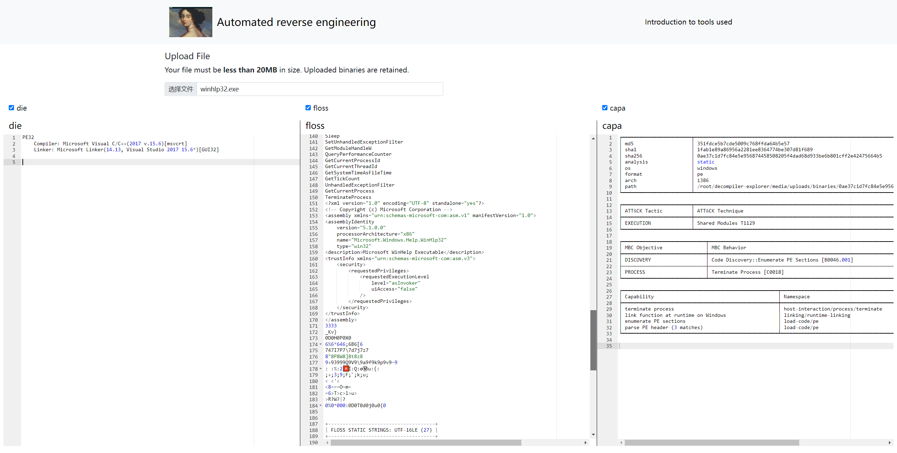

# Automated reverse engineering

## Prerequisites
- python >= 3.8

## Run
python3 ./manage.py migrate  
python3 ./manage.py collectstatic  
python3 ./manage.py ensure_admin  

python3 ./manage.py runserver 0.0.0.0:7755

## Credits to  
https://github.com/decompiler-explorer/decompiler-explorer  

## Show Project 

架构太传统了，想尝试一些新的web项目架构，此项目不维护了。
